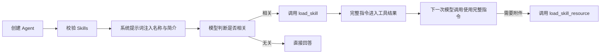

# Skills 渐进式加载

## 目标

Skills 用于承载只在特定任务中需要的操作规则、业务流程和参考资料。Agent 的常驻系统提示词只注入 Skill 名称与简介，模型判断相关后再读取完整内容，从而减少无关上下文和规则干扰。

本实现兼容常见的 `SKILL.md` 目录约定：

```text
skills/
└── add-friend/
    ├── SKILL.md
    ├── references/
    ├── assets/
    └── scripts/
```

`SKILL.md` 使用 YAML frontmatter 描述名称、简介、兼容性等元数据，正文保存完整指令。Skill 可以从本地目录、`fs.FS` 或应用自己的数据库适配器加载。

## 运行流程



Blades 的 Agent Loop 已经会把工具调用和工具结果写入会话，并继续发起下一次模型调用。因此 Skills 只需要复用现有 Tool 机制，不需要修改模型循环。

## 对外接口

- `skills.Skill`：最小能力接口，便于数据库或远端注册中心实现。
- `skills.New`：创建内存 Skill。
- `skills.NewFromDir`：从本地目录加载。
- `skills.NewFromEmbed`：从 `fs.FS` 加载。
- `blades.WithSkills`：把 Skills 绑定到 Agent。
- `list_skills`：返回当前可用 Skill 目录。
- `load_skill`：返回一个 Skill 的完整指令、元数据和资源索引。
- `load_skill_resource`：按路径读取 Skill 附带资源。

## 权限边界

Skill 内容负责告诉模型“怎么做”，不负责决定“能不能做”。三个内置 Skill 工具和其他 Tool 一样经过 Blades Policy；`allowed-tools` 仅保留为标准 frontmatter 元数据，不会扩大 Agent 权限。

内置实现不执行 `scripts/` 下的文件，只允许模型按资源读取。需要脚本执行的应用应单独提供受 Policy 管理的沙箱工具。

## 当前范围

当前阶段实现 Skill 说明的渐进式加载。业务工具仍在 Agent 启动时解析并提供给模型；“加载某个 Skill 后才暴露其绑定工具”属于下一阶段，需要在模型调用之间维护已激活 Skill 集合，并让 Tool Resolver 按该集合重新生成工具快照。
