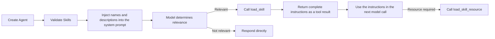

# Progressive Skill Loading

## Goals

Skills contain task-specific operating rules, business workflows, and reference material. An Agent's persistent system prompt includes only each Skill's name and description. The model loads the complete content only after deciding that a Skill is relevant, reducing unrelated context and instruction interference.

The implementation follows the common `SKILL.md` directory convention:

```text
skills/
└── add-friend/
    ├── SKILL.md
    ├── references/
    ├── assets/
    └── scripts/
```

`SKILL.md` uses YAML frontmatter for metadata such as the name, description, and compatibility requirements. Its Markdown body contains the complete instructions. Skills can be loaded from a local directory, an `fs.FS`, or an application-specific database adapter.

## Runtime Flow



The Blades Agent Loop already appends tool calls and tool results to the session before starting the next model call. Skills therefore reuse the existing Tool mechanism without changing the model loop.

## Public API

- `skills.Skill`: the minimal interface for database or remote registry implementations.
- `skills.New`: creates an in-memory Skill.
- `skills.NewFromDir`: loads Skills from a local directory.
- `skills.NewFromEmbed`: loads Skills from an `fs.FS`.
- `blades.WithSkills`: attaches Skills to an Agent.
- `list_skills`: returns the catalog available to the current Agent.
- `load_skill`: returns one Skill's complete instructions, metadata, and resource index.
- `load_skill_resource`: reads an additional resource by path.

## Authorization Boundary

Skill content tells the model how to perform a task; it does not decide whether the task is permitted. The three built-in Skill tools pass through Blades Policy like every other Tool. The `allowed-tools` frontmatter field is retained as standard metadata and cannot expand an Agent's permissions.

The built-in implementation allows files under `scripts/` to be inspected as resources but never executes them. Applications that require script execution should provide a separate sandboxed Tool protected by Policy.

## Current Scope

This stage implements progressive loading for Skill instructions. Business tools are still resolved and exposed when the Agent starts. Exposing tools only after their associated Skill has been loaded is a separate stage: it requires tracking the active Skill set between model calls and rebuilding the Tool Resolver snapshot from that state.
