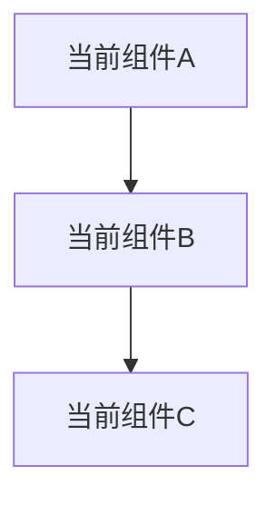
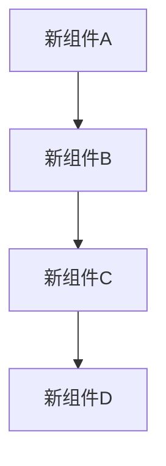

# [架构名称]

## 概述

用一段话概括这个架构设计的核心内容。

## 现状分析

### 当前架构



描述当前架构的特点。

### 存在的问题

1. 问题 1
2. 问题 2
3. 问题 3

### 问题影响

- 影响 1
- 影响 2

## 目标架构

### 设计目标

- 目标 1
- 目标 2
- 目标 3

### 架构设计



### 核心模块

#### 模块 1

**职责**: 描述模块职责

**接口**:
```go
// 接口定义
```

**实现要点**:
- 要点 1
- 要点 2

---

#### 模块 2

**职责**: 描述模块职责

**接口**:
```go
// 接口定义
```

**实现要点**:
- 要点 1
- 要点 2

## 演进路径

### 阶段 1: [阶段名称]

**时间**: [预计时间]

**目标**: 描述这个阶段的目标

**任务**:
1. 任务 1
2. 任务 2
3. 任务 3

**交付物**:
- 交付物 1
- 交付物 2

---

### 阶段 2: [阶段名称]

**时间**: [预计时间]

**目标**: 描述这个阶段的目标

**任务**:
1. 任务 1
2. 任务 2

**交付物**:
- 交付物 1
- 交付物 2

## 兼容性考虑

### 向后兼容

说明如何保证向后兼容，或者如何处理不兼容的情况。

### 迁移策略

1. 迁移步骤 1
2. 迁移步骤 2
3. 迁移步骤 3

## 风险与挑战

| 风险 | 影响 | 概率 | 缓解措施 |
|------|------|------|----------|
| 风险 1 | 高/中/低 | 高/中/低 | 缓解措施 |
| 风险 2 | 高/中/低 | 高/中/低 | 缓解措施 |

## 成功指标

- 指标 1: 具体的衡量标准
- 指标 2: 具体的衡量标准
- 指标 3: 具体的衡量标准

## 参考资料

- [参考文档 1](URL)
- [参考文档 2](URL)
