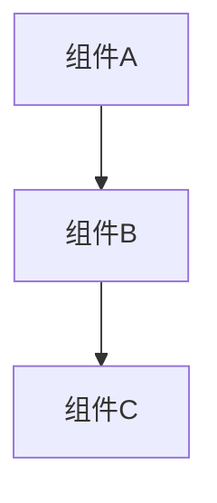

# [设计名称]

## 背景与动机

### 现状

描述当前系统的状态和存在的问题。

### 问题

明确需要解决的核心问题。

### 目标

- 目标 1
- 目标 2
- 目标 3

## 方案设计

### 方案概述

用一段话概括设计方案的核心思想。

### 架构设计

### 详细设计

#### 模块 1

描述模块 1 的设计。

#### 模块 2

描述模块 2 的设计。
